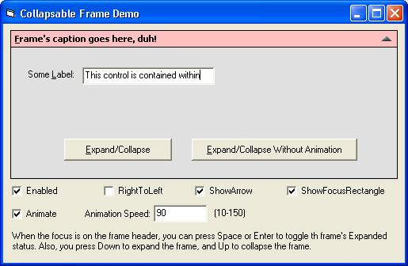



## Collapsable Frame

### Description

This is a modified version of the the frame which can be expanded or collapsed with or without animation. The control is greatly customizable in terms of appearance.

----

Updated 13/9:

- Prevented if user tries to change the height of the frame in code while the fame is collapsed

- Added CaptionMousePointer property

- Added ability to change caption tooltip when in expanded and collapsed mode

----

Updated 28/7:

- Added ShowFocusRectangle property

- Added Enabled property

- Added ExpandedHeight property

- Fixed bug that occurs if user continously holds down the Space or Enter key while the frame has the focus
 
### More Info
 

             |
---                |---
**Submitted On**   |2004-09-11 17:27:12
**By**             |[Alaeddin Hallak](https://github.com/Planet-Source-Code/PSCIndex/blob/master/ByAuthor/alaeddin-hallak.md)
**Level**          |Intermediate
**User Rating**    |4.0 (24 globes from 6 users)
**Compatibility**  |VB 6\.0
**Category**       |[OLE/ COM/ DCOM/ Active\-X](https://github.com/Planet-Source-Code/PSCIndex/blob/master/ByCategory/ole-com-dcom-active-x__1-29.md)
**World**          |[Visual Basic](https://github.com/Planet-Source-Code/PSCIndex/blob/master/ByWorld/visual-basic.md)
**Archive File**   |[Collapsabl1794459162004\.zip](https://github.com/Planet-Source-Code/alaeddin-hallak-collapsable-frame__1-55208/archive/master.zip)

